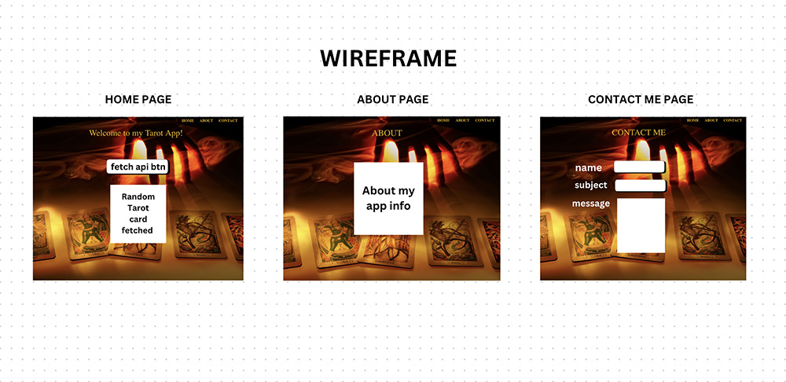
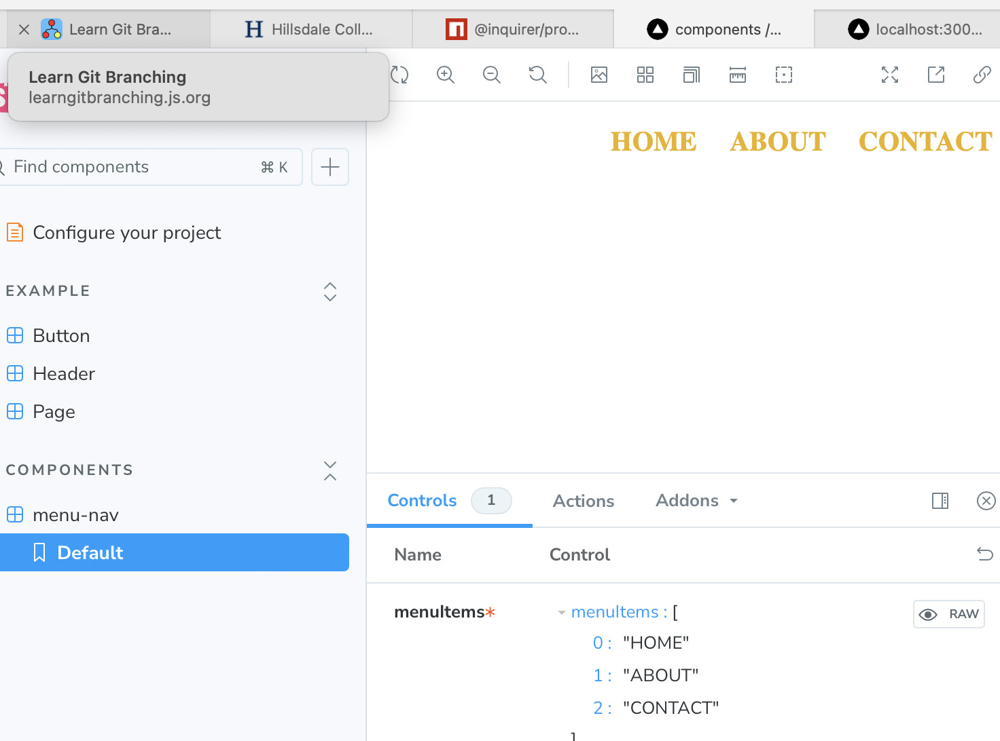
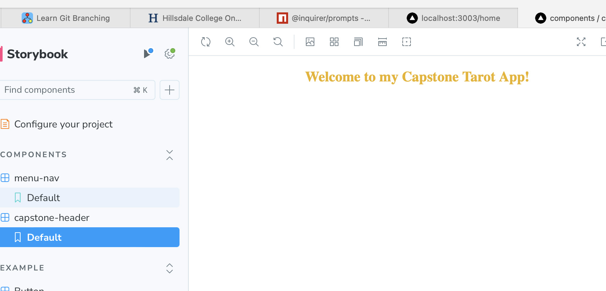
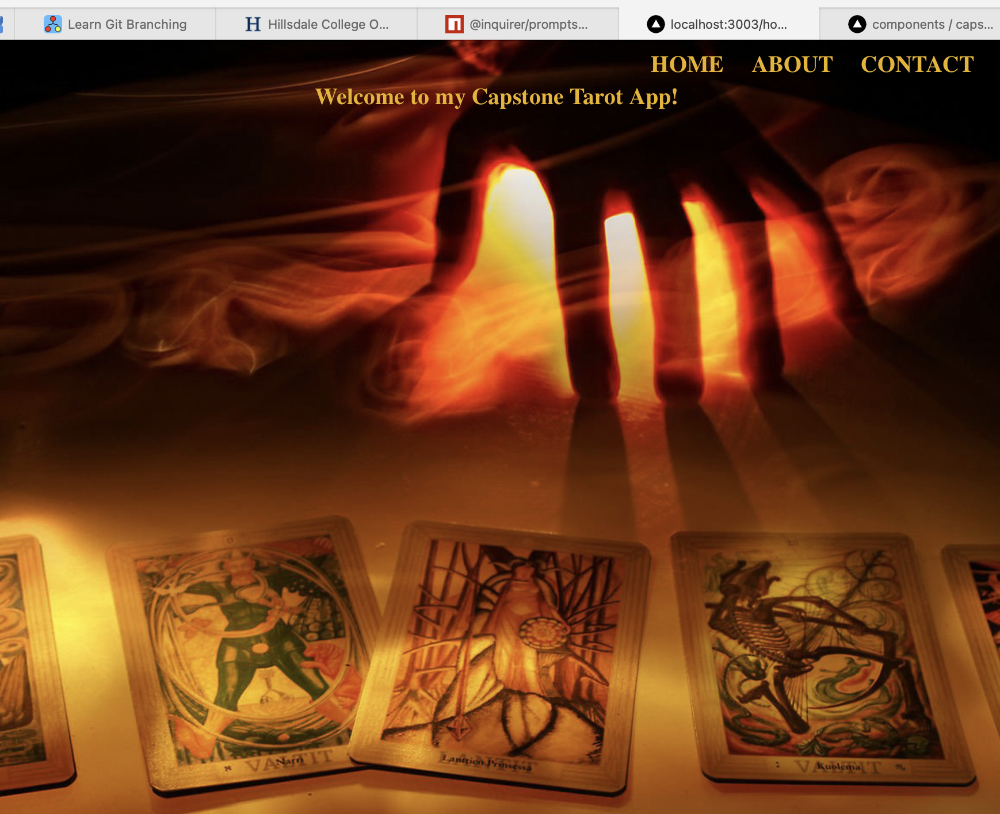

### Daily Project Log Day 1, Week 2 11/18/2024
### Tasks completed

- Added a contact page with an email form that integrates an api endpoint with api keys hidden in a proxy server.
- styled and edited components more with tailwind css.
- edited About page content.
- edited global.css style by removing tailwind defaults
- edited tarot-data.json content
- update readme.md

### Daily Project Log Day 5, Week 1
### Tasks completed

- installed @designbycode/tailwindcss-text-stroke to enable my header component to have text-stroke ability
- installed npm install --save-dev @iconify/tailwind for icon component
- created a Tarot Icon component on storybook
- installed daisyui@latest (npm i -D daisyui@latest) to enable more CSS component style features
- update readme.md

### Daily Project Log Day 4, Week 1
### Tasks completed

- update tarot-data.json with more detailed data on the major arcana tarot cards
- successfully fetched tarot-data and tarot card images onto home.js 
- create AboutHeader component on storybook
- begin about.js with and About header component and 'About' my project information
- add an .env.local file with resend api keys for contact.js page that will use Resend for a contact-me email form

## Next Steps are to work more on the about.js page and the contact.js page

### Daily Project Log Day 3, Week 1
### Tasks completed

- create tarot-data.json with extensive data on the major arcana tarot cards
- fetch tarot-data onto my homepage 
- stylize fetch button with tailwind
- stylize nav menu component with tailwind

### Challenges 

- I can successfully fetch tarot data from the .json file that I created, but retrieving the card images from the link urls is challenging. 

### Daily Project Log Day 2, Week 1
### Create Wireframe & update Readme.md
### Challenges 

- The tarot api that I was planning on using doesn't include the tarot images so I need to find another tarot api that includes the images of each card.

    

### Daily Project Log Day 1, Week 1

Monday Nov 11, working on menu-nav & header components on storybook and on home.js main page setting the background image for my Capstone Tarot App project. The lack of design control in storybook w tailwind is very limiting and challenging as creative frontend design is very important to me. 

   

    

   

- Next Steps are to create a wireframe on Canva and implement the fetch tarot api that will show a random tarot card spread on my home.js page*

You can check out [the Next.js GitHub repository](https://github.com/vercel/next.js) - your feedback and contributions are welcome!

## Deploy on Vercel

The easiest way to deploy your Next.js app is to use the [Vercel Platform](https://vercel.com/new?utm_medium=default-template&filter=next.js&utm_source=create-next-app&utm_campaign=create-next-app-readme) from the creators of Next.js.

Check out our [Next.js deployment documentation](https://nextjs.org/docs/pages/building-your-application/deploying) for more details.
