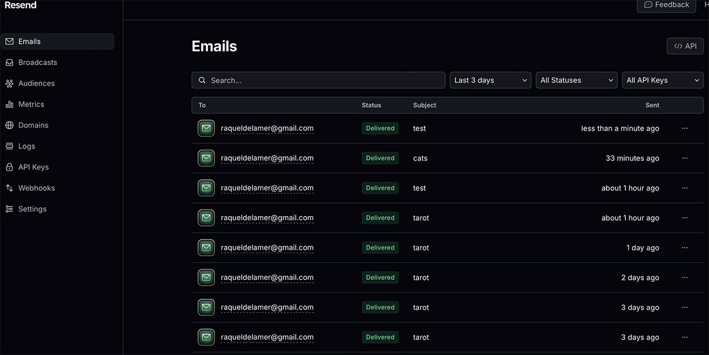

### Submit Capstone Project Web App with API Integration / Cohort 3 11/23/2024

- [x] Wireframes: Create wireframes for your web app, including the main components and layout. This includes components and their hierarchy and data flow. (Use this when you plan out your components and create stories in StoryBook.)
- [x] Readme: Create a `README.md` file that explains your project. This should include a description of your project, how to run it, and how to test it. (In some ways, this is the most important part of your project. It is the first thing people will see when they visit your project.)
- [x] At least 3 pages: Create at least 3 pages for your web app. This should include a home page, a page for your API integration and an about page. (You can add more pages if you like.)
- [x] Components: Create at least 5 components. - Capstone Header - About Header - Menu Nav bar - tarot icon - contact social media icon
- [x] Test tools: Use StoryBook to test at least 3 of your components. 
- [x] Thoughtful design: Use Tailwind CSS or another CSS Framework (like Bootstrap) to style your web app. (Bonus if you use a CSS framework like Daisy UI or shadcn/ui.)
- [x] API Integration: Integrate an API into your project. This should be an API that requires and API key hidden behind a proxy server. Create at least 2 routes in the `/api` folder in your Next.js project.
- [x] Services: Your web app should have at least one service that fetches data from the API and passes it to your components. It should also be able to send an email to you when a user submits a form.
- [x] .env file: Use a `.env.local` file to store your API key and other sensitive information. Make a `.env.local.example` file to show what keys are needed to run your app. 
- [ ] Authentication: (optional) Implement Magic Link email authentication in your project.
- [x] Persistent Data: Use a database to store data in your project. We will use upstash with Vercel to store data. The data should come from the user and be stored in the database. Examples include favorites, likes, comments, etc. (upstash is a Redis database that is free to use with Vercel.)
- [ ] RESTful Routes (optional): Implement RESTful routes in your project. This should include at least one route for each CRUD operation (Create, Read, Update, Delete). (Try for Create and Read, at least. Then add Update and Delete if you have time.)

### Daily Project Log Day 4, Week 2 
### Tasks completed
- updated the menu-nav component with a Link href ="/" for the index.js page
- updated About data
- Started the Capstone Powerpoint presentation
- update readme.md

### Daily Project Log Day 3, Week 2 
### Tasks completed
- updated About info
- changed home.js to index.js
- edited & stylized contact card form 
- update readme.md

### Daily Project Log Day 2, Week 2 
### Tasks completed
- installed @upstash/redis via npm
- Integrated redis with POST method to store user email data
- Update contact.js to fetch email api data utilizing POST method
- debugged about.js html to make page Vercel friendly
- added api keys into Environment Variables on Vercel
- deployed site onto Vercel
- update readme.md

### Challenges
- Vercel took a while to deploy being that it is very finicky about quotations used in HTML

### Test Email status 200
 

    

### Daily Project Log Day 1, Week 2 11/18/2024
### Tasks completed
- Added a contact page with an email form that integrates an api endpoint with api keys hidden in a proxy server.
- styled and edited components more with tailwind css.
- edited About page content.
- edited global.css style by removing tailwind defaults
- edited tarot-data.json content
- update readme.md

### Daily Project Log Day 5, Week 1
### Tasks completed

- installed @designbycode/tailwindcss-text-stroke to enable my header component to have text-stroke ability
- installed npm install --save-dev @iconify/tailwind for icon component
- created a Tarot Icon component on storybook
- installed daisyui@latest (npm i -D daisyui@latest) to enable more CSS component style features
- update readme.md

### Daily Project Log Day 4, Week 1
### Tasks completed

- update tarot-data.json with more detailed data on the major arcana tarot cards
- successfully fetched tarot-data and tarot card images onto home.js 
- create AboutHeader component on storybook
- begin about.js with and About header component and 'About' my project information
- add an .env.local file with resend api keys for contact.js page that will use Resend for a contact-me email form

## Next Steps are to work more on the about.js page and the contact.js page

### Daily Project Log Day 3, Week 1
### Tasks completed

- create tarot-data.json with extensive data on the major arcana tarot cards
- fetch tarot-data onto my homepage 
- stylize fetch button with tailwind
- stylize nav menu component with tailwind

### Challenges 

- I can successfully fetch tarot data from the .json file that I created, but retrieving the card images from the link urls is challenging. 

### Daily Project Log Day 2, Week 1
### Create Wireframe & update Readme.md
### Challenges 

- The tarot api that I was planning on using doesn't include the tarot images so I need to find another tarot api that includes the images of each card.

    

### Daily Project Log Day 1, Week 1

Monday Nov 11, working on menu-nav & header components on storybook and on home.js main page setting the background image for my Capstone Tarot App project. The lack of design control in storybook w tailwind is very limiting and challenging as creative frontend design is very important to me. 

   

    

   

- Next Steps are to create a wireframe on Canva and implement the fetch tarot api that will show a random tarot card spread on my home.js page*

You can check out [the Next.js GitHub repository](https://github.com/vercel/next.js) - your feedback and contributions are welcome!

## Deploy on Vercel

The easiest way to deploy your Next.js app is to use the [Vercel Platform](https://vercel.com/new?utm_medium=default-template&filter=next.js&utm_source=create-next-app&utm_campaign=create-next-app-readme) from the creators of Next.js.

Check out our [Next.js deployment documentation](https://nextjs.org/docs/pages/building-your-application/deploying) for more details.
